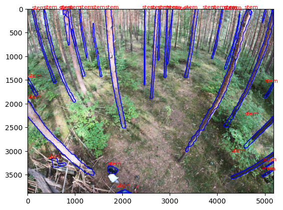

# Tutorial_Tree_Segmentation

This tutorial details the creation of a tree mask in our GoPro image from a segmentation instance model in Darwin V7. 

## 1. Apply the model on your image 

To apply the model on your image, you need to open the code runmodel.py in order to modify the path to image and result folder. If you want to use another model, you will also need to modify the API key associated to the model. To find the API key, open V7 Lab and go the setting; you will find it in the API Keys section. 

Then open the command prompt, go to the folder where you want your result stored or directly modify output directory in line 25, and then type the following command line to start running the code :

```
$ python3 runmodel.py
```

## 2. Show the result 

In order to visualise the resulted detection of one image, open the code showModelResult.ipynb in Visual Studio Code, modify the path to the image and its detection and run the cells of the code. 

You will get a result like the following : 



## 3. Apply the detection as mask in the image 

To apply the detection as a mask in the associated image, open the file segmentated_img.ipynb and modify the image and json result path (both cells). You can then run the cells to obtain a new folder with the masked images. 
